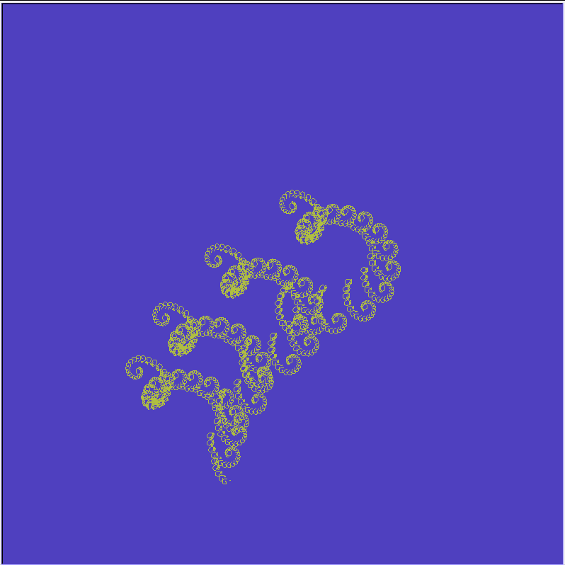

# TEAM 16 - Fractal DSL project Documentation

## Introduction

Welcome to the Fractal DSL (Domain Specific Language) documentation! This DSL is designed to simplify the creation of intricate fractal patterns, allowing users to generate stunning visual art with ease. Whether you're a seasoned fractal enthusiast or a curious beginner, this language empowers you to explore the captivating world of fractal geometry.

## Overview

The Fractal DSL provides a user-friendly interface for defining and rendering various types of fractals. It abstracts complex algorithms into straightforward commands, enabling users to focus on creativity rather than implementation details. This documentation serves as your guide to understanding the language syntax, key features, and practical usage.

## Key Elements

### 1. Commands

The DSL supports a set of predefined commands for configuring and rendering fractals. These include:

- `size`: Specifies the size of the fractal canvas.
- `color`: Sets the color of the fractal lines or shapes.
- `background`: Defines the background color of the canvas.
- `shape`: Chooses the type of fractal to generate (e.g., Sierpinski triangle, Koch snowflake).
- `direction`: Sets the initial direction or angle for rendering.
- `speed`: Controls the rendering speed.
- `draw`: Determines whether to render the fractal immediately or not.

### 2. Parameters

Users can customize fractals by adjusting various parameters associated with each fractal shape:

- `edges` (default for shapes like snowflake): Number of edges in the fractal.
- `direction` (default for star shapes): Angle of rotation or direction.
- `length` (default for tree shapes): Maximum length of fractal branches.
- `points_nr` (default for fern shapes): Number of points or iterations.
- `depth`: Depth or complexity of the fractal.
- `size`: Overall size of the fractal.
- `color`: Line or fill color of the fractal.
- `speed`: Rendering speed of the fractal.
- `shape`: Type of fractal to generate.
- `background`: Background color of the canvas.

### 3. Default Values

If a parameter is not explicitly defined by the user, the DSL automatically assigns default values to ensure seamless fractal generation. This simplifies the creation process by reducing the need for exhaustive parameter specification.
- `edges = 6`  - Default number of edges (Snowflake)  
- `direction = 90`  - Default direction (Star)  
- `length = 2`  - Default max length (Golden tree)  
- `points_nr = 100`  - Default number of points (Barnsley Fern)  
- `depth = 5`  - Default depth of the fractals that need it
- `size = 700`  - Default size of the canvas
- `color = 'black'`  - Default color of the fractal 
- `speed = 0`  - Default speed of rendering the fractal 
- `shape = 'triangle'`  - Default shape to be drawn  
- `background = 'white'`  - Default background color
## Theoretical Considerations

### Solution Proposal

Our Fractal DSL aims to democratize fractal creation by offering a simplified syntax and comprehensive grammar. Key features include:

- **Simplified Syntax**: Minimizes the learning curve with predefined statements.
- **Comprehensive Grammar**: Facilitates clear expression of fractal designs and algorithms.
- **Versatility**: Supports diverse shapes, colors, rotations, and transformations.
- **Ease of Use**: Provides a user-friendly interface for both experts and novices.
- **Customization**: Enables personalized designs through parameter adjustments.

### Implementation Approach

The DSL is implemented as an internal DSL embedded within a host language. This approach ensures seamless integration and efficient execution of fractal algorithms. The implementation prioritizes performance and scalability to handle complex computations effectively.

### Impact and Benefits

The Fractal DSL's development holds potential for:

- **Accessibility**: Lowering the entry barrier for fractal creation.
- **Education**: Fostering understanding of mathematical concepts through practical application.
- **Artistic Expression**: Enabling artistic exploration and creation.
- **Research Advancement**: Accelerating research in fractal geometry.
- **Cross-Disciplinary Applications**: Extending utility beyond mathematics to art, design, and education.

## Running the code:
### py PATH_TO_FILE/main.py PATH_TO_FILE/text_file.txt

## Explanations for the fractals:
### For more clarity in the images, please click on the image to open it in another tab.
### 1. Sierpinski Triangle:
#### Customization:
The Sierpinski triangle is a fractal shape formed by recursively subdividing a triangle into smaller triangles. Each iteration removes the inner triangle, leaving a pattern that exhibits self-similarity at different scales.

- **shape 'triangle':** To call the Sierpinski Triangle.
- **size**: The size of the triangle is adjustable depending on the size of the canvas. (INT input)
- **depth**: Specifies the depth (number of levels) of the triangle. (INT input)
#### Example of code
##### Example 1
```
size 800  
color '#804CB3'  
background '#80B34C'  
shape 'triangle'  
depth 2  
speed 0  
draw 0
```
##### Output 1
<p align="center">
  
 </p>

##### Example 2
```
size 800  
color '#4DB25E'  
background '#B24DA1'  
shape 'triangle'  
depth 5  
speed 0  
draw 0
```
##### Output 2
<p align="center">
  
 </p>
 
### 2. Koch Snowflake:
#### Customization
The Koch snowflake is a fractal curve that starts with an equilateral triangle and repeatedly replaces each line segment with a pattern resembling a snowflake. It demonstrates infinite perimeter within a finite area.

- **shape 'koch' or chape 'koch snowflake':** To call the Koch Snowflake.
- **size**: The size of the snowflake is adjustable depending on the size of the canvas. (INT input)
- **depth**: Specifies the depth (complexity) of the snowflake. (INT input)
#### Example of code
##### Example 1
```
size 800  
color '#53A9AC'  
background '#AC5653'  
shape 'koch'  
depth 3  
speed 0  
draw 0
```
##### Output 1
<p align="center">
  
 </p>

##### Example 2
```
size 800  
color '#DABD25'  
background '#2542DA'  
shape 'koch snowflake'  
depth 5  
speed 0  
draw 0
```
##### Output 2
<p align="center">
  
 </p>

### 3. Dragon Curve
#### Customization
The Dragon curve is a self-replicating fractal that forms a continuous loop resembling the shape of a dragon. It is constructed using a recursive process of repeatedly folding and rotating line segments.

- **shape 'dragon':** To call the Dragon Curve.
- **size**: The size of the curve is adjustable depending on the size of the canvas. (INT input)
- **depth**: Specifies the depth (complexity) of the dragon curve. (INT input)
#### Example of code
##### Example 1
```
size 800  
color '#2DFF00'  
background '#D200FF'  
shape 'dragon'  
depth 10  
speed 0  
draw 0
```
##### Output 1
<p align="center">
  
 </p>
 
##### Example 2
```
size 800  
color '#27C7D8'  
background '#9127D8'  
shape 'dragon'  
depth 12  
speed 0  
draw 0
```
##### Output 2
<p align="center">
  
 </p>
 
### 4. Capital I
#### Customization
The Capital I fractal is a simple yet intriguing fractal formed by repeated iterations of adding bars to the sides of a central bar. The result is a visually captivating pattern reminiscent of the letter "I."

- **shape 'capital':** To call the Capital I.
- **size**: The size of the fractal is adjustable depending on the size of the canvas. (INT input)
- **depth**: Specifies the depth (number of levels) of the Capital. (INT input)
#### Example of code
##### Example 1
```
size 800  
color '#4865B7'  
background '#48B762'  
shape 'capital'  
depth 4  
speed 0  
draw 0
```
##### Output 1
<p align="center">
  
 </p>
 
##### Example 2
```
size 800  
color '#4865B7'  
background '#B79A48'  
shape 'capital'  
depth 6  
speed 0  
draw 0
```
##### Output 2
<p align="center">
  
 </p>
 
### 5. Barnsley Fern
#### Customization
The Barnsley Fern is a fractal pattern that closely resembles the shape of a fern leaf. It is generated using an iterative mathematical system known as an iterated function system (IFS).

- **shape 'fern' or shape 'barnsley fern':** To call the Barnsley fern.
- **points**: The number of points used to create the fractal. (INT input)
#### Example of code
##### Example 1
```
size 800  
color '#56CC33'  
background '#4865B7'  
shape 'fern'  
points 10000  
speed 0  
draw 0
```
##### Output 1
<p align="center">
  
 </p>
 
##### Example 2
```
size 800  
color '#56CC33'  
background '#4865B7'  
shape 'barnsley fern'  
points 1000000  
speed 0  
draw 0
```
##### Output 2
<p align="center">
  
 </p>
 
### 6. Golden Tree
#### Customization
The Golden Tree fractal exhibits a tree-like structure with branches based on the golden ratio. It grows recursively by branching at certain angles and lengths, resulting in an aesthetically pleasing tree shape.

- **shape 'tree' or shape 'golden tree':** To call the Golden Tree.
- **size**: The size of the tree is adjustable depending on the size of the canvas. (INT input)
- **depth:** Specifies the depth (number of levels) of the Tree. (INT input)
#### Example of code
##### Example 1
```
size 800  
color '#C76E38'  
background '#3891C7'  
shape 'tree'  
depth 3  
speed 0  
draw 0
```
##### Output 1
<p align="center">
  
 </p>
 
##### Example 2
```
size 800  
color '#EEE311'  
background '#EE118B'  
shape 'tree'  
depth 30  
speed 0  
draw 0
```
##### Output 2
<p align="center">
  
 </p>
 
### 7. Five Pointed star
#### Customization
The 5 Pointed Star is a fractal design featuring a star shape composed of smaller nested stars. Each iteration adds complexity by subdividing each line segment into smaller segments, forming a star-like pattern.

- **shape 'star':** To call the 5 Pointed Star.
- **size**: The size of the main star is adjustable depending on the size of the canvas. (INT input)
- **direction**: Specifies the rotation angle of the star. (INT input)
#### Example of code
##### Example 1
```
size 800  
color '#EEE311'  
background '#EE118B'  
shape 'star'  
direction 90  
speed 0  
draw 0
```
##### Output 1
<p align="center">
  
 </p>
 
##### Example 2
```
size 800  
color '#FEE201'  
background '#01A541'  
shape 'star'  
direction 270  
speed 0  
draw 0
```
##### Output 2
<p align="center">
  
 </p>
 
### 8. N edged Snowflake
#### Customization
The n Edged Snowflake is a fractal shape constructed by recursively drawing line segments that branch out from a central point. The fractal evolves based on a specified number of edges (`n`), depth, and length of the initial line segment. Each iteration subdivides the line segments into smaller segments, creating a snowflake-like pattern with `n` edges.

- **shape 'snowflake':** To call the Snowflake.
- **size**: The size of the snowflake is adjustable depending on the size of the canvas. (INT input)
- **depth**: Specifies the depth (number of levels) of the snowflake. (INT input)
- **edges:** Specifies the number of edges of the snowflake. (INT input)
#### Example of code
##### Example 1
```
size 800  
color '#00A6E7'  
background '#110079'  
shape 'snowflake'  
edges 6  
depth 4  
speed 0  
draw 0
```
##### Output 1
<p align="center">
  
 </p>
 
##### Example 2
```
size 800  
color '#00A6E7'  
background '#110079'  
shape 'snowflake'  
edges 32  
depth 6  
speed 0  
draw 0
```
##### Output 2
<p align="center">
  
 </p>
 
### 9. Gardi Fractal
#### Customization
The Gardi Fractal is a geometric pattern generated by recursively placing two circles at specified positions. Each iteration reduces the size of the circles, resulting in an intricate and visually appealing arrangement resembling a series of interconnected loops or arcs.

- **shape 'gardi' or shape 'circle':** To call the Gardi circle.
- **size**: The size of the main circles is adjustable depending on the size of the canvas. (INT input)
- **depth**: Specifies the depth (number of levels) of the fractal. (INT input)
- **direction:** Specifies the rotation of the fractal. (INT input)
#### Example of code
##### Example 1
```
size 800  
color '#D0A1AB'  
background '#55AA98'  
shape 'circle'  
direction 90  
depth 6  
speed 0  
draw 0
```
##### Output 1
<p align="center">
  
 </p>
 
##### Example 2
```
size 800  
color '#4176BE'  
background '#BE8941'  
shape 'gardi'  
direction 0  
depth 3  
speed 0  
draw 0
```
##### Output 2
<p align="center">
  
 </p>
 
### 10. Spiral of spirals
#### Customization
The Spiral of Spirals is a fractal composed of nested spirals that continuously decrease in size as they spiral inward. It demonstrates self-similarity and exhibits an intriguing visual appearance reminiscent of seashells or galaxies.
##### That fractal will render a lot of time!
- **shape 'spiral':** To call the Spiral.
- **size**: The size of the spiral is adjustable depending on the size of the canvas. (INT input)
- **direction**: Specifies the rotation of the fractal. (INT input)
#### Example of code
```
size 800  
color '#B0BF40'  
background '#4F40BF'  
shape 'spiral'  
direction 90  
speed 0  
draw 0
```
#### Output
<p align="center">
  
 </p>

### 11. Star Fractal
#### Customization
Star Fractal is composed of repeated copies of a pentagram or other polygon.

- **Length** : The side length of the star.
- **Penc** : The color of the star’s outline.
- **Fillcolor** : The fill color of the star.
- **n** :Specifies the depth (complexity). (INT input)
#### Example of code
##### Example 1
```
size 800
color 'yellow'
background 'dark blue'
shape 'star fractal'
depth 2
fill 'true'
speed 0
draw 0
```
##### Output 1
<p align="center">
  
 </p>
 
##### Example 2
```
size 800
color 'orange'
background 'light blue'
shape 'star fractal'
depth 5
fill 'false'
speed 0
draw 0
```
##### Output 2
<p align="center">
  
 </p>
 
### 12. Vicsek Fractal
#### Customization
In mathematics the Vicsek fractal, also known as Vicsek snowflake or box fractal,is a fractal originating from a structure similar to that of the Sierpiński carpet, developed by Tamás Vicsek. It has applications include as tiny antennas, particularly in cellular phones.

- **Length** : Length of current fractal par.
- **Penc** : The color of the outline.
- **Fillcolor** : The fill color of the fractal parts
- **n** :Specifies the depth (complexity). (INT input)
#### Example of code
##### Example 1
```
\begin{verbatim}
size 800
color 'brown'
background 'gray'
shape 'vicsek'
depth 2
speed 0
fill 'true'
instant 'false'
draw 0
```
##### Output 1
<p align="center">
  
 </p>
 
##### Example 2
```
size 800
color 'yellow'
background 'black'
shape 'vicsek'
depth 6
speed 0
fill 'false'
instant 'true'
draw 0
```
##### Output 2
<p align="center">
  
 </p>

 ### 13. Cesaro Fractal
#### Customization
Cesaro Fractal is composed of repeated iterations of a shape with its edges modified by a specified angle, creating a jagged and intricate pattern.

- - **Length** : Length of current fractal par.
- **Penc** : The color of the outline.
- **Fillcolor** : The fill color of the fractal parts
- **n** :Specifies the depth (complexity). (INT input)
#### Example of code
##### Example 1
```
size 800
color 'light green'
background 'black'
shape 'cesaro'
ratio '0.48'
speed 0
instant 'true'
draw 0
```
##### Output 1
<p align="center">
  
 </p>
 
##### Example 2
```
size 800
color 'white'
background 'blue'
shape 'cesaro'
ratio '0.33'
speed 0
instant 'true'
draw 0
```
##### Output 2
<p align="center">
  
 </p>
 
### 14. Hilbert Curve
#### Customization
Hilbert Curve is composed of a continuous fractal space-filling curve, created through recursive iterations that divide a plane into smaller segments, resulting in a complex, meandering path that covers every point in a square grid.

- **Level** : Specifies the depth (complexity) of the Hilbert curve.
- **Angle** : The angle by which the turtle turns during each step of the recursion.
- **Step** : Length of each segment in the fractal.
- **Size** : The total size of the Hilbert curve.
#### Example of code
##### Example 1
```
\begin{verbatim}
size 800
color 'blue'
background 'pink'
shape 'hilbert'
depth 2
speed 0
instant 'false'
draw 0
```
##### Output 1
<p align="center">
  
 </p>
 
##### Example 2
```
size 800
color 'orange'
background 'dark green'
shape 'hilbert'
depth 8
speed 0
instant 'true'
draw 0
```
##### Output 2
<p align="center">
  
 </p>

 ______________________________________
## Conclusion

The Fractal DSL represents a paradigm shift in fractal generation, offering a powerful yet accessible tool for enthusiasts, artists, educators, and researchers. This documentation aims to empower users to engage meaningfully with fractal geometry and unleash their creativity through digital art and exploration. Happy fractal designing!
